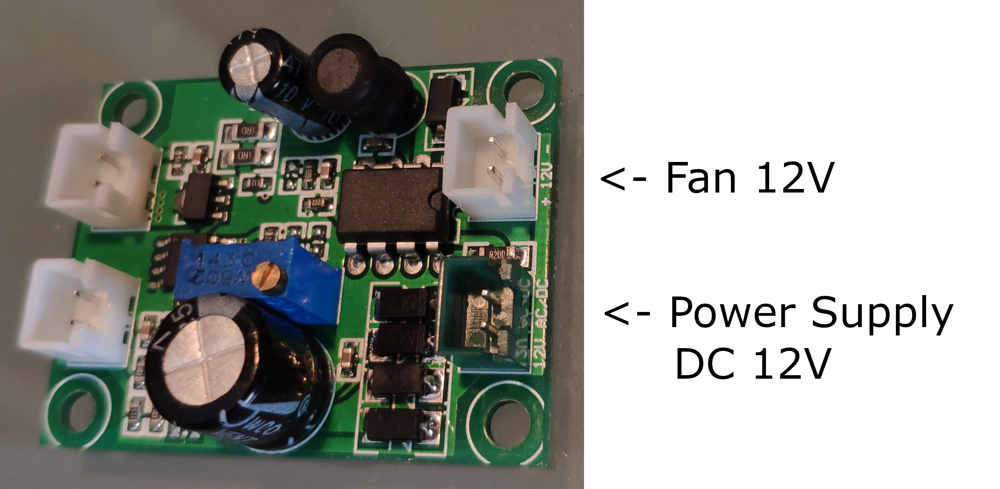
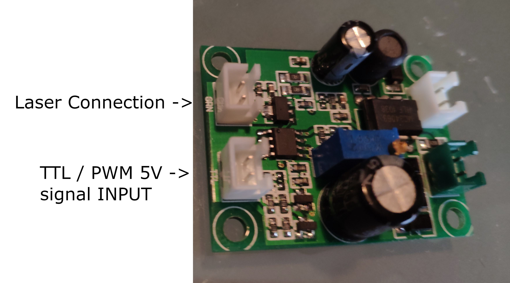

# Marlin Laser Engraver 2

## Upload considerations
- In some ocassions, we need to unplug the screen to upload the code.

## Laser: Laser power 500 mW walelength 405 nm

## Screen: RepRapDiscount Smart Controller

This Smart Controller contains a SD-Card reader, a rotary encoder and a 20 Character x 4 Line LCD display. You can easy connect it to your Ramps board using the "smart adapter" included.

After connecting this panel to your Ramps you don't need your pc any more, the Smart Controller supplies power for your SD card. Further more all actions like calibration, axes movements can be done by just using the rotary encoder on the Smart Controller. Print your 3D designs without PC, just with a g-code design stored on the SD card.

[RepRapDiscount Smart Controller](https://reprap.org/wiki/RepRapDiscount_Smart_Controller)

Change line 1532 to #define REPRAP_DISCOUNT_SMART_CONTROLLER (just remove the // at the beginning)

Change line 1429 to #define SDSUPPORT (just remove the // at the beginning)

EXP1 is for LCD

EXP2 is for SDCard (Recommended to shield this cable with aluminium foils)

## Calculations of stepper motor
Maximum Amperaje

IMax = 0.85 (Current/Phase) * 2 (Phase) = 1.7 A

Maybe can increase to 2 A

## Issues
- X-axis of the board seems not working smoothly, so via software we change the X-axis to Z-axis and viceversa. Change pins of the output. [TODO]